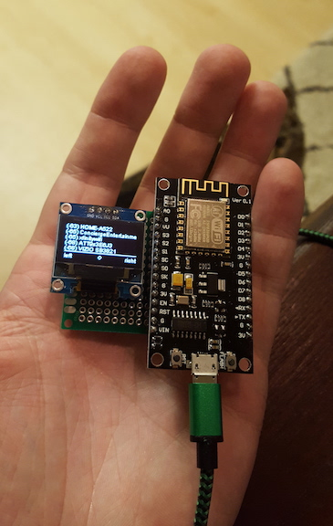
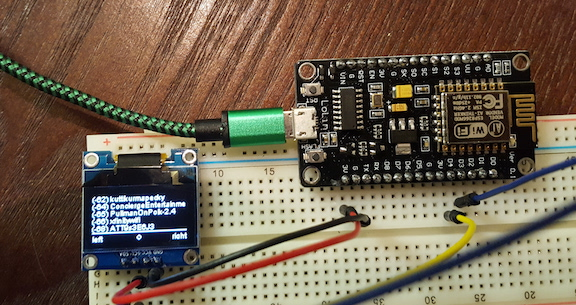
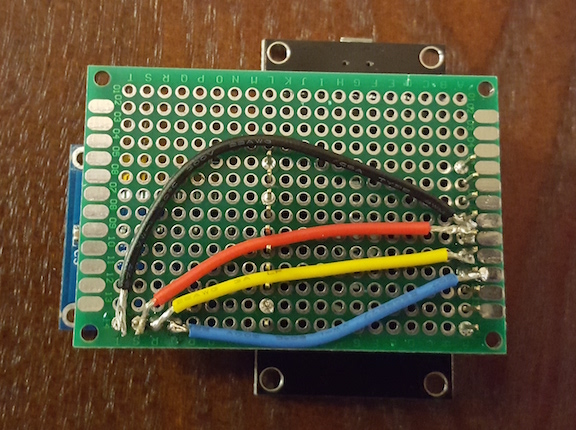
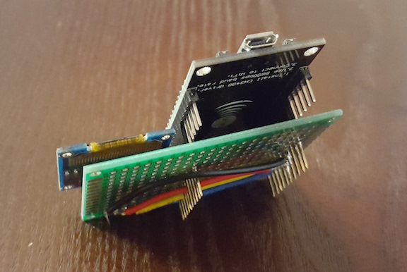

# ESP8266 War Walker

This project was partly inspired by [War Collar Industries' Dope Scope](http://warcollar.com/products/dopescope.html) and partly inspired by always having to fix friends' or family's WiFi Access Points.

If being able to view the Access Points in real-time sounds interesting to you, this could be your next project!

# What you'll need

You can build this project for under $6 in materials, assuming you have some basic equipment.

### Electronics:

#### ESP8266
  This is the brains of the operation.

  From Wikipedia: The ESP8266 is a low-cost Wi-Fi chip with full TCP/IP stack and MCU (Micro Controller Unit) capability produced by Shanghai-based Chinese manufacturer, Espressif Systems.

  Basically, it was first used as an add-on module for Arduino to add WiFi connectivity. As the chip grew popular, makers realized that the chip was powerful enough to write the programs on the chip itself, in addition to its regular TCP/IP functionalities. Over time, future evolutions added various auxiliary components allowing us to flash the chip without a separate FTDI board. We will be taking advantage of these capabilities to write software for this special platform.

#### OLED Screen
This project uses a .96 inch, 128x64 pixel resolution OLED screen using the SSD1306 drivers. They are extremely cheap, and fairly high resolution for being smaller than a postage stamp.

#### MicroUSB cable.
You have one of these in a drawer. I guarantee it. Or you can power it with a small lipo battery.

### Other Parts

I prototyped everything on a breadboard, then I soldered the OLED directly to a prototype PCB. There are 4 short 24AWG wires connecting the pins to stackable headers upon which the ESP8266 plugs in.

Optional Parts:
  * Breadboard
  * Jumper wires
  * Soldering Iron
  * Solder
  * Prototype PCB board
  * 4x 24AWG wires
  * 2x 8 pin stackable headers

### Purchase
If you'd like to purchase this, I'd recommend the following units:

## Cheap
These units are rock bottom prices, and of fair quality - I've used them, they work. But you'll be waiting about a month for them to come in. (You'll probably want to order a few in case one breaks or is defective.) Also, you are really at the liberty of the seller's reputation. If the seller doesn't come through, you really don't have much protection.
  * https://www.aliexpress.com/item/Free-Shipping-White-and-Blue-color-0-96-inch-128X64-OLED-Display-Module-For-arduino-0/32233367757.html?spm=2114.13010608.0.0.zd9qNE
  * https://www.aliexpress.com/item/New-Wireless-module-CH340-NodeMcu-V3-Lua-WIFI-Internet-of-Things-development-board-based-ESP8266/32469469145.html?spm=2114.13010608.0.0.zd9qNE

## Expensive:
These units are marked up by retailers. But that also means they are backed by retailers with return policies. They are good quality. Also you can recieve them in a few days.
  * https://www.amazon.com/DIYmall-Nodemcu-ESP8266-CP2102-Wifi/dp/B00XJG7GEK/ref=sr_1_1?ie=UTF8&qid=1476901862&sr=8-1-spons&keywords=nodemcu&psc=1
  * https://www.amazon.com/Diymall-Serial-128x64-Display-Arduino/dp/B00O2KDQBE/ref=sr_1_3?ie=UTF8&qid=1476901886&sr=8-3&keywords=OLED+.96

# Instructions

For these instructions, I will not discuss the hardware in much detail, as it will depend how you setup your breadboard.

Here is what I used:

OLED Pins -> ESP8266 Pins
  * GND -> G
  * VCC -> v3
  * SDA -> D3
  * SCL -> D4

## Commands

To load the firmware onto the ESP8266 I used Platformio.

  * Install the drivers for your ESP8266/NodeMCU board.
  * Install platformio
  * Install the correct board for platformio to know what to build against
    * I've included my platformio.ini file for reference
  * Install libraries 561, 562 and 563 with "platformio lib install"
    * `pio lib install 561`
    * `pio lib install 562`
    * `pio lib install 563`
  * Sanity check yourself by running a hello world blink program using the onboard LED. If you are stuck with anything before this, google + stack overflow will be your best friends.
  * Build and upload the firmware
    * `pio run -t upload`
  * Monitor the Serial connection for debugging purposes
    * `pio -f -c atom serialports monitor --port /dev/cu.wchusbserial1410 --baud 115200`
  * Profit!

Happy War Walking y'all!

# ToDo
  * Fix scrolling screen bug. Where screen results scroll in from the right side of the screen and move left. I'm pretty sure this is a quirk in the ui library.
  * Make the scan function async and have the screen update at regular intervals. Will need to finish the pointers branch & implement locking mechanism
  * Add a frequency scanner/plotter on another screen to show channel usage and provide spectrum analysis.
